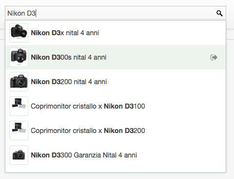

jQuery Ajax Search
=================

This is a light jQuery plugin that transforms an input text `html` tag into a powerful ajax-enabled search field using a `json` datasource.

This plugin assumes that the datasource is a `json` object list (e.g., e-commerce products) formatted with these properties: 

```json
[
	{
	    "id": "1",
	    "title": "Apple object",
	    "url": "object-url-apple.html",
	    "thumbUrl": "images-repository\/apple.jpg"
	}, {
	    "id": "2",
	    "title": "Peach object",
	    "url": "object-url-peach.html",
	    "thumbUrl": "images-repository\/peach.jpg"
	},
	...
	...
	...
]
```

The whole list is actually loaded once via Ajax when the user inserts a text into the search field, then the list is cached into the browser's memory for all the next searches.

Please note that the search is performed on the `title` property of each list object.

## Features
The user can navigate the search result list using either the `Up` and `Down` arrow keys or the mouse move and an item can be selected using either the mouse left click or the `Enter` key.

## Installation

The `html` code might be something like this:

```html
<input name="foo" id="ajaxSearchField" type="text" />
```

The `javascript` script to execute is the following (after the `html` input field):

```javascript
(function($){
	$("#ajaxSearchField").ajaxSearch({
		contentSourceUrl: "http://localhost/something-to-search.json",
		placeholder: "Type something to search...",
		onSelected : function(listObject) {
			// this handler is called when the user selects a search result item
			// listObject is the JavaScript object rappresentation for the 
			// list's item found into the datasource and selected by the user
			
			// example:
			console.log(listObject);
		},
		onUnselectedEnter: function (searchText) {
			// this handler is called when the user hit the Enter key on the search field, 
			// but any result's item was selected; searchText contains the current text 
			// submitted by the user
			
			// example:
			alert('The user searched for ' + searchText + ', but with no results found (selected)');
		}
	});
}(jQuery));
```

## Example
Here there is an image example for a particular implementation I've made for a production website application. The searched text is `Nikon D3` and a subset of items are selected from the entire given `json` list downloaded using Ajax. When the user selects one item from the result list, the browser redirects the user to the product page using the `listObject.url` property.


